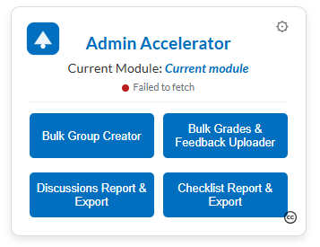

# Admin Accelerator Suite (Brightspace / D2L)

A single self-contained HTML file that adds four time-saving admin tools to any Brightspace (D2L)
course, behind one launcher. Built on Brightspace's own API, so it works on any instance.

## Tools

- **Bulk Group Creator** — create groups with *dynamic descriptions* generated from an Excel sheet
  (member names, emails, roles per group).
- **Bulk Grades & Feedback Uploader** — upload grades and written feedback (including private
  instructor comments) from one spreadsheet.
- **Discussions Report & Export** — view every post across all forums and topics, with replies and
  attachment links, a live name search, and Excel export.
- **Checklist Report & Export** — see whole-class checklist progress at a glance and export it.

Everything (markup, styles, scripts, logo) lives in **`AdminAcceleratorSuite.html`**. There is no
build step and nothing else to upload.

## Screenshot

<!-- Add a screenshot to docs/launcher.png and it will show here -->

## How it works

- **One file, four isolated tools.** The launcher and all four tools live in the single HTML file.
  Clicking a tool builds it inside its own isolated in-page frame, so the tools never conflict.
- **Course context via replace strings.** The current course ID and name come straight from
  Brightspace's `{OrgUnitId}` / `{OrgUnitName}` replace strings, which Brightspace fills in when the
  page is rendered as content or a widget.
- **Authenticated API calls.** Each tool calls the Brightspace Valence API with your existing login
  session (`credentials: 'include'`), auto-detects the instance's latest API versions, and attaches
  the XSRF token for actions that create or update data.

> Because the tools use your authenticated session, the page must be served **from your Brightspace
> domain** (i.e. added inside a course). Opening the file from your desktop will not authenticate.

## Install

Paste the **entire** contents of `AdminAcceleratorSuite.html` into Brightspace using either method.
Open the file in a plain-text editor, select all, and copy.

### Option A — Course content page

1. **Content → New → Create a Page.**
2. Switch the HTML editor to **source / code view** (`</>`).
3. Paste the full file source and **Save**.
4. Open the topic — the launcher appears and detects the current course automatically.

### Option B — Course homepage widget

1. **Course Admin → Widgets → Create Widget.**
2. On the **Content** tab, switch to **source / code view** (`</>`) and paste the full source.
3. **Save**, then add the widget via **Course Admin → Homepages → [your homepage] → Add Widgets**.

## Configuration

Edit the `window.SUITE_CONFIG` block near the top of `AdminAcceleratorSuite.html`:

- `brandColor` / `brandColorDark` — theme colour (default: D2L blue `#006fbf`).
- `logo` / `logoAlt` — replace the placeholder logo (data URI or URL; `""` hides it).
- `title`, `author`, `licenseLabel`, `licenseUrl` — launcher heading and attribution.
- `tools[]` — the launcher buttons (label and tooltip for each tool).

No other edits are needed to deploy on a new instance.

## Requirements

- A Brightspace/D2L instance with the Valence API enabled.
- A user account with permission to perform the actions (create groups, edit grades, read
  discussions/checklists) in the target course. The tools act as *you*, using your session.

## License

Admin Accelerator © 2025 by John Morrissey, licensed under
[CC BY-NC-SA 4.0](https://creativecommons.org/licenses/by-nc-sa/4.0/) — see `LICENSE.txt`.
You may share and adapt it for non-commercial purposes with attribution, distributing derivatives
under the same license.
